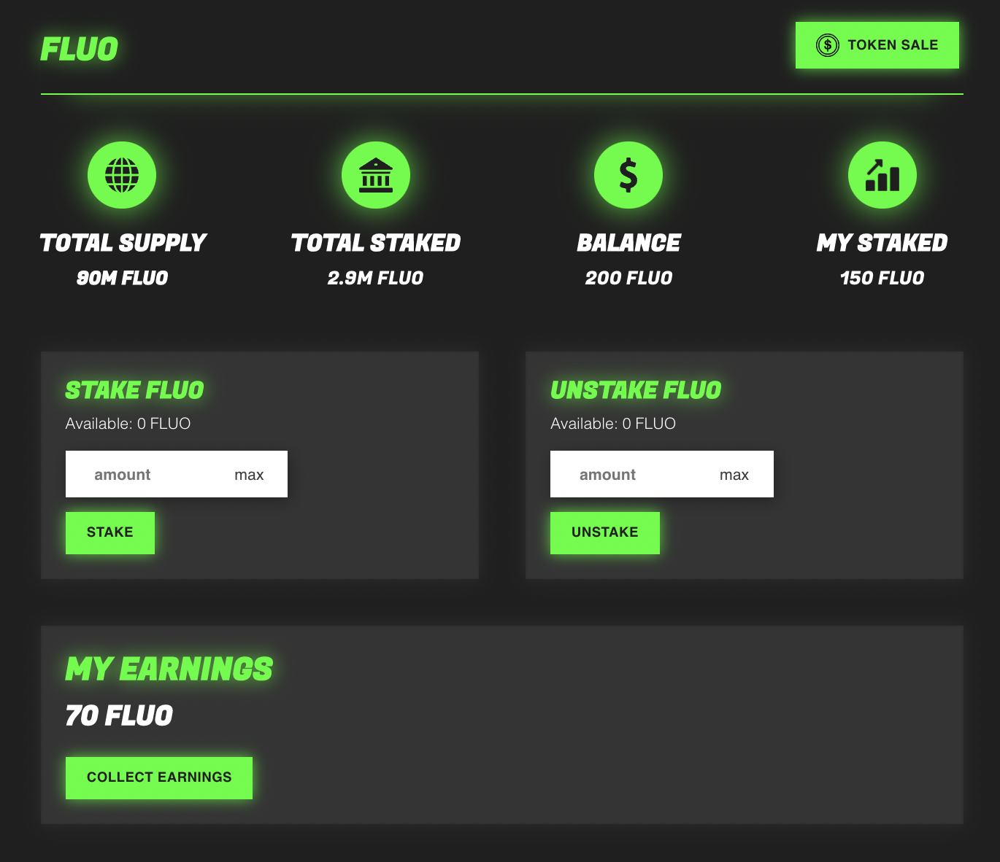

# Staking

Users can freely stake or unstake Fluo as they please. The Fluo staking mechanism is designed to be as flexible and safe as possible.
It is superior to other staking protocols as the staking rewards are fully backed by the networks income.

## Fluo Wallet

Fluo can be staked using the Fluo wallet. To get started, head over to [https://fluo.finance/wallet](http://fluo.finance/wallet) and press "connect wallet" to connect a wallet of choice.
To start staking, simply enter an amount and press "stake". Staked funds can be unstaked at any time or point.

## Staking APY

Unlike many other tokens, Fluo does not have a fixed APY. The APY is dependent on how many Fluo you stake and how many transactions are happening on the network.
Eg. If 10M Fluo total is staked and you stake 5M, you will get half of all staking rewards. In this example, that will be 1% of each transaction.
The more transactions there are, the more you will earn.